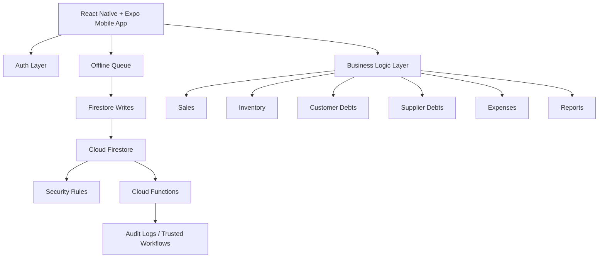
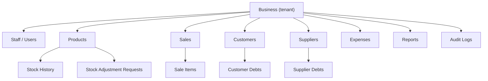
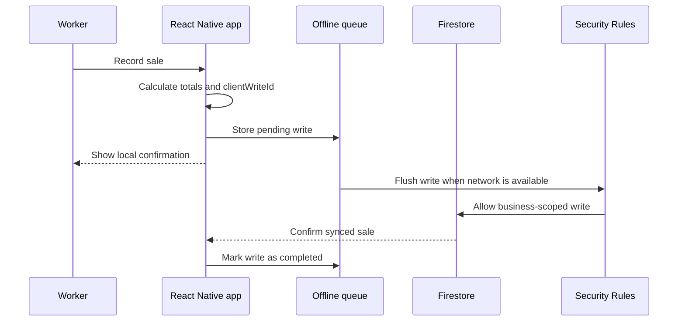

# Ururiye

> A Somali-first POS and business management app for small shops, pharmacies, markets, restaurants, and local businesses in Somaliland.

**Built with React Native · Expo · TypeScript · Firebase Auth · Firestore · Security Rules · Offline Queues**

---

> **Note on source code**
>
> Ururiye is an active commercial product, and its production source code is private. This repository is a public engineering case study. It documents the product, architecture, technical decisions, and engineering work without exposing application source code, Firebase configuration, API keys, security rules, customer data, or internal business logic.
>
> All diagrams and descriptions are intentionally generalized.

---

## Table of Contents

1. [Product Overview](#product-overview)
2. [Problem](#problem)
3. [Solution](#solution)
4. [Tech Stack](#tech-stack)
5. [Core Features](#core-features)
6. [Architecture](#architecture)
7. [Data & Access Model](#data--access-model)
8. [Offline Sales Workflow](#offline-sales-workflow)
9. [Security & Permissions](#security--permissions)
10. [Testing](#testing)
11. [Engineering Challenges Solved](#engineering-challenges-solved)
12. [My Role](#my-role)
13. [Status](#status)
14. [Screenshots](#screenshots)

---

## Product Overview

Ururiye is a Somali-first business management and POS app designed for small businesses that need a simple way to manage daily operations from a phone.

The app helps business owners move away from notebooks, memory, and scattered WhatsApp messages by organizing sales, stock, debts, expenses, staff activity, receipts, and reports in one structured system.

The product is designed for real local operating conditions:

- Somali-first user experience
- Mobile-first workflows
- Small Android screen support
- Offline-tolerant writes
- Owner, manager, and worker roles
- Simple daily business reporting

---

## Problem

Many small businesses in the target market manage operations manually.

Common problems include:

- **Sales are not consistently recorded** — owners may not know what was sold today.
- **Stock is hard to control** — products can run out or be adjusted without accountability.
- **Debts are mixed together** — customer debts and supplier debts are often tracked in notebooks or memory.
- **Expenses are forgotten** — daily costs are not always connected to profit calculations.
- **Staff activity is hard to verify** — owners need visibility into what workers changed or recorded.
- **Network reliability is inconsistent** — the app must tolerate poor mobile connectivity.

The goal is not only to build a POS screen. The harder problem is building a simple, trustworthy business system that works for non-technical shop owners in real daily conditions.

---

## Solution

Ururiye provides a structured mobile system for small business operations.

The platform supports:

- Sales recording
- Product and stock management
- Customer debt tracking
- Supplier debt tracking
- Expense tracking
- Profit estimation
- Staff roles and permissions
- Receipts
- Reports
- Offline queued writes
- Audit-oriented activity tracking

The design principle is simple: make important business actions fast for workers, visible to owners, and safe against duplicate writes or unauthorized changes.

---

## Tech Stack

| Layer | Technology |
|---|---|
| **Mobile app** | React Native, Expo, TypeScript |
| **Authentication** | Firebase Authentication |
| **Database** | Cloud Firestore |
| **Authorization** | Firebase Security Rules and role-based access control |
| **Backend logic** | Firebase Cloud Functions where server-side trust is required |
| **Offline support** | App-level queued writes and retry handling |
| **Receipts** | Expo print / sharing workflows |
| **Testing** | Jest, React Native Testing Library, Firebase Emulator Suite |
| **Language** | Somali-first product copy with English technical implementation |

---

## Core Features

### Sales

Owners and staff can record daily sales, including:

- Cash sales
- Mobile money sales
- Credit sales
- Product-based sales
- Receipt generation
- Cost of goods sold tracking
- Estimated profit calculation

Sales are designed with idempotent writes to reduce duplicate transaction risk when the app is offline or the network is unstable.

### Inventory Management

Ururiye includes product and stock management for small businesses.

Features include:

- Add and edit products
- Track stock quantity
- Low-stock alerts
- Buying price and selling price
- Stock history
- Stock adjustment requests
- Approval workflow for sensitive stock changes

This helps owners understand what is available, what is running low, and where stock changes came from.

### Debt Tracking

The app separates two important debt types:

- **Customer debt** — money customers owe the business
- **Supplier debt** — money the business owes suppliers

This distinction matters because many shops sell on credit while also buying stock from suppliers on delayed payment terms.

### Expenses

Owners can record daily business expenses such as:

- Rent
- Transport
- Staff costs
- Utilities
- Supplies
- Other operating costs

Expenses are included in dashboard and reporting calculations.

### Staff Roles and Permissions

Ururiye supports multiple user roles:

- Owner
- Manager
- Worker

Permissions are enforced both in the UI and Firestore Security Rules.

Example restrictions:

- Workers can record sales and operational activity.
- Managers can access reports and supplier-related workflows.
- Owners control staff access and business settings.

### Reports

Ururiye provides business insights such as:

- Daily sales
- Monthly sales
- Expenses
- Profit estimate
- Outstanding debts
- Low-stock products
- Staff activity
- Stock changes

The reports are designed to help non-technical business owners understand their business quickly.

---

## Architecture

Ururiye uses a mobile-first Firebase architecture. The React Native app handles user workflows, local state, and offline queues. Firestore stores business data, Security Rules enforce access, and Cloud Functions handle trusted backend workflows where needed.

### Key Architectural Decisions

- **Mobile-first workflows**  
  Business actions are optimized for phone use, not desktop-first administration.

- **Offline-tolerant writes**  
  Important actions can be queued locally and retried when the device reconnects.

- **Idempotent sales writes**  
  Client write IDs reduce duplicate transaction risk when a write is retried.

- **Role-based access control**  
  Owner, manager, and worker capabilities are enforced in both UI and Firestore rules.

- **Business-scoped data model**  
  Each business operates inside its own data boundary.

---

## Data & Access Model

Ururiye's data model is organized around a business tenant.

### Role Scoping

| Role | Scope of access |
|---|---|
| **Owner** | Full business control, staff management, settings, reports, and operational data |
| **Manager** | Operational management, reports, supplier workflows, stock approvals depending on configuration |
| **Worker** | Daily operational actions such as sales, customer activity, expenses, and stock requests |

The UI limits what each role sees, but Firestore Security Rules are the actual enforcement boundary.

---

## Offline Sales Workflow

Sales are one of the most important workflows because a duplicate sale or missing sale can affect stock, debts, revenue, and reports.

### Offline Considerations

- Queue writes locally
- Attach client write IDs
- Prevent duplicate sales
- Retry failed writes
- Drop repeatedly failed writes after a safe limit
- Flush only writes belonging to the current authenticated user
- Preserve enough data to reconcile stock, revenue, debt, and reporting flows

---

## Security & Permissions

Security is treated as a data-layer responsibility, not only a UI concern.

### Security Model

- **Firebase Authentication** establishes identity.
- **Business membership** determines which business data a user can access.
- **Role permissions** determine what actions a user can perform.
- **Firestore Security Rules** enforce access at the database boundary.
- **Cloud Functions** handle workflows that require server-side trust.

### Permission Examples

- A worker can record sales but cannot manage staff.
- A manager can access reports if allowed by the role matrix.
- An owner can invite or remove staff.
- A user from Business A cannot access Business B's data.
- Sensitive stock changes can require request/approval workflows.

Actual rule definitions and Firebase configuration are private and intentionally not published here.

---

## Testing

Testing focuses on the highest-risk areas: sales accuracy, stock integrity, role permissions, offline queue behavior, and Firestore access control.

### Testing Strategy

- **Unit tests**  
  Business logic for sales totals, profit estimation, debt flows, stock changes, and role permissions.

- **Component tests**  
  React Native UI flows for sales, products, debts, expenses, and reports.

- **Security Rules tests**  
  Firebase Emulator Suite tests verify that users can only access authorized business data.

- **Offline queue tests**  
  Queue behavior is tested for retry handling, user scoping, duplicate prevention, and failure limits.

---

## Engineering Challenges Solved

### 1. Offline-safe sales recording

Designed a queued-write flow with client write IDs so unstable connectivity does not create duplicate sales.

### 2. Stock accountability

Added stock history and stock adjustment requests so sensitive stock changes are visible and traceable.

### 3. Customer vs supplier debt separation

Modeled money owed to the business separately from money the business owes suppliers, matching real small-business workflows.

### 4. Role-based staff operations

Created an owner/manager/worker permission model so staff can perform daily work without gaining full access to sensitive reports or settings.

### 5. Business-scoped Firestore access

Structured data and rules around business membership so one business cannot access another business's records.

### 6. Local market fit

Designed the app Somali-first with simple mobile workflows for real shop owners, not only technical users.

---

## My Role

I designed and built Ururiye as the product's React Native / Firebase engineer.

Responsibilities included:

- React Native + Expo + TypeScript mobile development
- Somali-first product workflow design
- Firebase Authentication integration
- Firestore data modeling
- Firestore Security Rules strategy
- Offline queue architecture
- Sales and receipt workflows
- Inventory and stock management flows
- Customer and supplier debt workflows
- Expense and reporting logic
- Staff roles and permissions
- Testing strategy for business logic, rules, and offline behavior

---

## Status

- **Stage:** Active commercial product
- **Source code:** Private production repository
- **This repository:** Public engineering case study only

Representative roadmap areas:

- Better onboarding for small businesses
- Expanded reporting
- Improved stock approval workflows
- Continued offline reliability hardening
- Subscription and plan-based feature gating

---

## Screenshots

Screenshots should be redacted or mocked before publishing.

| Screen | Preview |
|---|---|
| Dashboard | `[Add screenshot here]` |
| Sales flow | `[Add screenshot here]` |
| Products / stock | `[Add screenshot here]` |
| Customer debts | `[Add screenshot here]` |
| Supplier debts | `[Add screenshot here]` |
| Expenses | `[Add screenshot here]` |
| Reports | `[Add screenshot here]` |
| Staff roles | `[Add screenshot here]` |

---

This README documents the engineering behind a private production application. It intentionally omits source code, Firebase configuration, credentials, customer data, and internal business logic.
